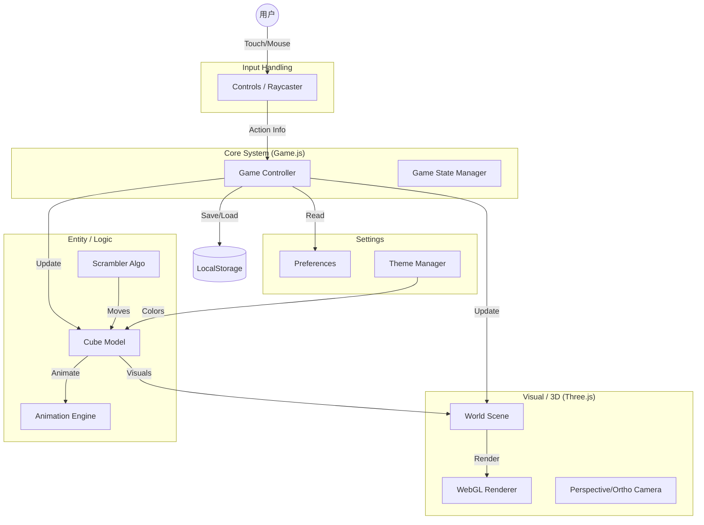

# The Cube - 架构指南

这份文档旨在为开发者提供 **The Cube** 项目的高层次技术概览，作为理解代码结构和数据流转的“上下文地图”。

## 1. 项目类型与目标

*   **项目类型**: 纯前端 Web 3D 游戏 / PWA (Progressive Web App)。
*   **目标**: 提供一个高性能、交互流畅、高度可定制的 Rubik's Cube (魔方) 模拟器。
*   **核心特征**:
    *   无后端依赖 (Static Site)。
    *   基于 **Three.js** 的 WebGL 渲染。
    *   完全基于 **ES6+ Class** 的面向对象设计。
    *   支持离线运行 (Service Workers via UpUp)。

## 2. 关键技术栈

| 类别 | 技术/库 | 说明 |
| :--- | :--- | :--- |
| **语言** | JavaScript (ES6+), SASS | 核心逻辑与样式开发 |
| **渲染引擎** | [Three.js](assets/js/three.js) | 处理 3D 场景、相机、光照与网格渲染 |
| **构建工具** | Rollup | 模块打包 (IIFE 格式) |
| **PWA 支持** | UpUp | 提供离线缓存与 Service Worker 管理 |
| **代码压缩** | Terser | 生产环境构建时的代码压缩 |
| **动画引擎** | 自研 (Tween.js/Animation.js) | 轻量级补间动画系统，非第三方库 |
| **持久化** | LocalStorage | 保存游戏进度、历史成绩、偏好设置 |

## 3. 核心目录导航与数据流

项目的源码主要位于 `src/` 目录下，编译后的产物输出至 `assets/` 或直接被 `index.html` 引用。

```text
src/
├── js/                  # 核心 JavaScript 逻辑
│   ├── Game.js          # [控制器] 顶级类，协调 World, Cube, Controls
│   ├── World.js         # [视图] 3D 场景管理 (Camera, Light, Renderer)
│   ├── Cube.js          # [模型] 魔方数据结构、几何体生成、状态管理
│   ├── Controls.js      # [输入] 处理触摸/鼠标事件，射线检测 (Raycasting)
│   ├── Scrambler.js     # [逻辑] 生成魔方打乱公式算法
│   ├── Storage.js       # [数据] LocalStorage 封装
│   ├── Preferences.js   # [配置] 用户设置管理
│   ├── ThemeEditor.js   # [工具] 主题编辑器逻辑
│   └── plugins/         # Three.js 自定义几何体插件
├── scss/                # UI 样式源码 (DOM 层)
└── game/                # (如果有) 其他游戏相关逻辑
```

## 4. 核心逻辑入口

理解以下文件是掌握整个系统的关键：

1.  **[index.html](index.html)**
    *   **作用**: 应用入口。定义了 UI 的 DOM 结构，加载 CSS 和最终构建的 `cube.js`。初始化 PWA (UpUp)。
2.  **[src/js/Game.js](src/js/Game.js)**
    *   **作用**: **上帝类 (God Class)**。它是游戏的主循环控制器。
    *   **职责**: 初始化 `World` 和 `Cube`，管理游戏状态 (MENU, PLAYING, SOLVED)，处理重置、开始游戏等全局指令。
3.  **[src/js/Cube.js](src/js/Cube.js)**
    *   **作用**: 魔方实体。
    *   **职责**: 无论是 2阶还是 5阶魔方，都由该类生成。它管理着所有小方块 (Cubelets) 的 3D 网格对象，以及魔方的当前逻辑状态。
4.  **[src/js/Controls.js](src/js/Controls.js)**
    *   **作用**: 交互桥梁。
    *   **职责**: 将用户的屏幕点击/滑动转换为 3D 空间中的射线，判断用户是想旋转视角还是旋转魔方的某一层。
5.  **[rollup.config.dev.js](rollup.config.dev.js)**
    *   **作用**: 构建配置。
    *   **职责**: 了解它是如何将分散的 ESM 模块打包成浏览器可执行的 IIFE 文件。

## 5. 架构图 (Mermaid)

以下简图展示了核心模块的调用与包含关系：



## 6. 开发模式总结

*   **架构模式**: **MVP (Model-View-Presenter) 变体**。
    *   **Model**: `Cube.js` 维护魔方的数据状态。
    *   **View**: `World.js` (3D场景) 和 DOM UI 负责显示，`Controls.js` 负责简单的视图输入捕获。
    *   **Presenter/Controller**: `Game.js` 作为协调者，接收输入，更新模型，并驱动视图刷新。
*   **状态管理**:
    *   没有使用 Redux/Vuex 等库。
    *   状态分散在各个类的实例属性中，通过 `Game` 实例单例进行全局协调。
    *   持久化状态通过 `Storage` 辅助类直接读写。
*   **交互逻辑**:
    *   **Raycasting**: 不依赖 DOM 事件绑定在 3D 物体上，而是通过统一的 `Controls` 层发射射线检测碰撞，计算旋转轴和方向。

## 7. 扩展建议：如何增加新功能？

如果你打算扩展本项目，可以参考以下路径：

*   **增加新的 3D 视觉效果或几何体**: 
    - 在 `src/js/plugins/` 下添加新的 Three.js 插件或自定义几何体。
    - 在 `src/js/World.js` 中调整灯光、相机或环境设置。
*   **增加新的魔方类型或转动逻辑**:
    - 修改 `src/js/Cube.js`。项目的 `Cube` 类已经支持动态设置尺寸（2x2 到 5x5），增加非标准魔方（如金字塔魔方）可能需要重构 `Cube` 类。
*   **修改 UI 布局或交互按钮**:
    - 在 `index.html` 中添加 DOM 元素。
    - 在 `src/scss/components/` 下添加或修改对应的 SASS 样式。
*   **增加新的游戏规则或社交功能**:
    - 在 `src/js/Game.js` 中增加状态机逻辑或事件监听。
    - 在 `src/js/Storage.js` 中扩展数据确保持久化。
*   **调整颜色主题**:
    - 在 `src/js/Themes.js` 中定义新的配色方案。
    - 使用 `src/js/ThemeEditor.js` 及其配套 UI(`ui__theme`) 进行交互式调整。
